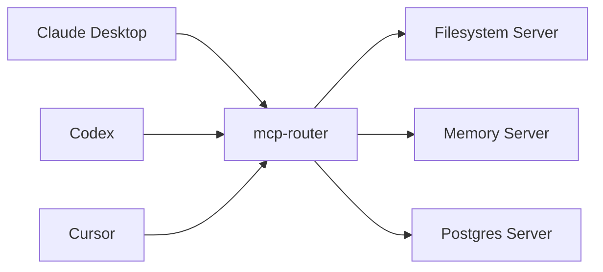

# mcp-router

**The Central Hub for your MCP Servers.**

Solve the problem of configuring the same MCP servers (Filesystem, Git, Memory, etc.) repeatedly in every IDE (Claude, Codex, Cursor, etc.). Configure them once in `mcp-router`, and point all your IDEs to this single router.

[中文文档](./README_CN.md)

## How it works



## Setup Guide

### 1. Initialize Configuration

Run this command to create the central config file at `~/.mcpr/mcp-router.config.json`:

```bash
npx --yes --package git+https://github.com/zxkws/mcp-router.git mcpr init
```

### 2. Add Servers

Edit `~/.mcpr/mcp-router.config.json` to include your tools.

**Example Configuration:**

```json
{
  "mcpServers": {
    "filesystem": {
      "transport": "stdio",
      "command": "npx",
      "args": ["-y", "@modelcontextprotocol/server-filesystem", "/Users/yourname/workspace"],
      "enabled": true
    },
    "memory": {
      "transport": "stdio",
      "command": "npx",
      "args": ["-y", "@modelcontextprotocol/server-memory"],
      "enabled": true
    }
  }
}
```

### 3. Connect your IDEs

Now point your IDEs to the router. No need to specify config paths—it automatically loads from `~/.mcpr/mcp-router.config.json`.

#### For Codex (`codex.toml`)

```toml
[mcp_servers.hub]
command = "npx"
args = [
    "-y",
    "--package", "git+https://github.com/zxkws/mcp-router.git",
    "mcpr",
    "stdio"
]
```

#### For Claude Desktop (`claude_desktop_config.json`)

```json
{
  "mcpServers": {
    "hub": {
      "command": "npx",
      "args": [
        "-y",
        "--package", "git+https://github.com/zxkws/mcp-router.git",
        "mcpr",
        "stdio"
      ]
    }
  }
}
```

---

## Why use this?

1.  **Write Once, Run Everywhere**: Add a new tool to your config, and it instantly appears in Claude, Codex, and any other client.
2.  **No Port Conflicts**: The router manages the connections via `stdio` or a single HTTP port.
3.  **Unified Logs**: Centralized logging for all tool usage.

## Advanced Usage

### Importing existing configs

Import your existing Claude config into your new central hub:

```bash
npx mcpr import --from ~/Library/Application\ Support/Claude/claude_desktop_config.json --format claude
```

### Quick Run (Zero Config)

Run *any* MCP server command (like `npx` or `python`) and expose it via the router without creating a config file.

```bash
# Exposes the @modelcontextprotocol/server-memory
npx --yes --package git+https://github.com/zxkws/mcp-router.git mcpr run -- npx -y @modelcontextprotocol/server-memory
```

## FAQ

### I configured `listen.http` but don't see a server at localhost:8080?
The `mcpr stdio` command (used by IDEs) **does not** start the HTTP server to avoid port conflicts when multiple IDE instances run.
To use the HTTP server, run `npx mcpr serve` in a separate terminal. Both will share the same config.

### Where is my config file?
By default, it is at `~/.mcpr/mcp-router.config.json`. You can edit this file to add more servers.

## License

MIT
