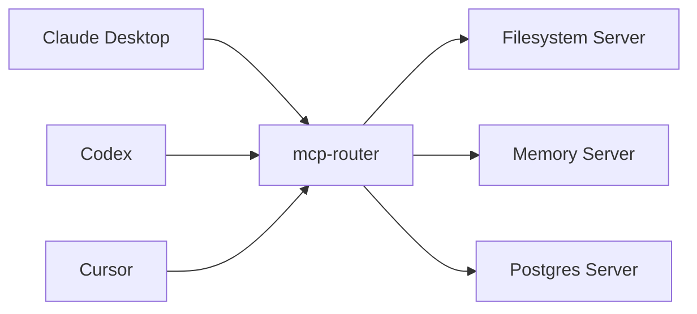

# mcp-router

**你的 MCP 服务器配置中心**

解决在每个 IDE（Claude, Codex, Cursor 等）中重复配置相同 MCP 服务器（如 Filesystem, Git, Memory 等）的问题。只需在 `mcp-router` 中配置一次，所有 IDE 即可共享。

## 工作原理



## 快速指南

### 1. 初始化配置

运行以下命令，在 `~/.mcpr/mcp-router.config.json` 创建中心配置文件：

```bash
npx --yes --package git+https://github.com/zxkws/mcp-router.git mcpr init
```

### 2. 添加服务器

编辑 `~/.mcpr/mcp-router.config.json`，添加你需要的工具。

**配置示例：**

提示：filesystem server 建议只指向你需要暴露的工作目录（避免把整个用户目录当作根目录）。

```json
{
  "mcpServers": {
    "filesystem": {
      "transport": "stdio",
      "command": "npx",
      "args": ["-y", "@modelcontextprotocol/server-filesystem", "/path/to/workspace"],
      "enabled": true
    },
    "memory": {
      "transport": "stdio",
      "command": "npx",
      "args": ["-y", "@modelcontextprotocol/server-memory"],
      "enabled": true
    },
    "playwright": {
      "transport": "stdio",
      "command": "npx",
      "args": ["-y", "@playwright/mcp@latest"],
      "enabled": true
    }
  }
}
```

### 3. 连接你的 IDE

配置 IDE 指向 Router。无需再指定配置文件路径，它会自动加载 `~/.mcpr/mcp-router.config.json`。

#### 对于 Codex (`codex.toml`)

```toml
[mcp_servers.hub]
command = "npx"
args = [
    "-y",
    "--package", "git+https://github.com/zxkws/mcp-router.git",
    "mcpr",
    "stdio"
]
```

#### 对于 Claude Desktop (`claude_desktop_config.json`)

```json
{
  "mcpServers": {
    "hub": {
      "command": "npx",
      "args": [
        "-y",
        "--package", "git+https://github.com/zxkws/mcp-router.git",
        "mcpr",
        "stdio"
      ]
    }
  }
}
```

---

## 为什么使用它？

1.  **一次编写，到处运行**：在配置中心添加一个新工具，它会立刻出现在 Claude、Codex 和其他所有客户端中。
2.  **无端口冲突**：Router 通过 `stdio` 或单一 HTTP 端口管理连接，避免了运行多个工具时的端口占用错误。
3.  **统一日志**：集中管理所有工具的调用日志。

## 高级用法

### 导入现有配置

将现有的 Claude 配置导入到新的中心配置中：

```bash
npx mcpr import --from ~/Library/Application\ Support/Claude/claude_desktop_config.json --format claude
```

### 快速运行 (零配置模式)

直接运行 *任何* MCP 服务器命令（如 `npx` 或 `python`）并通过 Router 暴露，无需创建配置文件。

```bash
# 暴露 @modelcontextprotocol/server-memory
npx --yes --package git+https://github.com/zxkws/mcp-router.git mcpr run -- npx -y @modelcontextprotocol/server-memory
```

## 常见问题 (FAQ)

### 我配置了 `listen.http` 但没有看到 localhost:8080 启动？
IDE 使用的 `mcpr stdio` 命令**不会**启动 HTTP 服务器，以避免多个 IDE 实例运行时产生端口冲突。
如果需要使用 HTTP 服务器，请在单独的终端中运行 `npx mcpr serve`。两者会共享相同的配置。

### 我的配置文件在哪里？
默认位于 `~/.mcpr/mcp-router.config.json`。你可以编辑此文件来添加更多服务器。

## License

MIT
